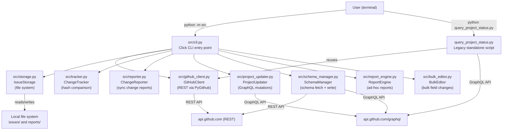
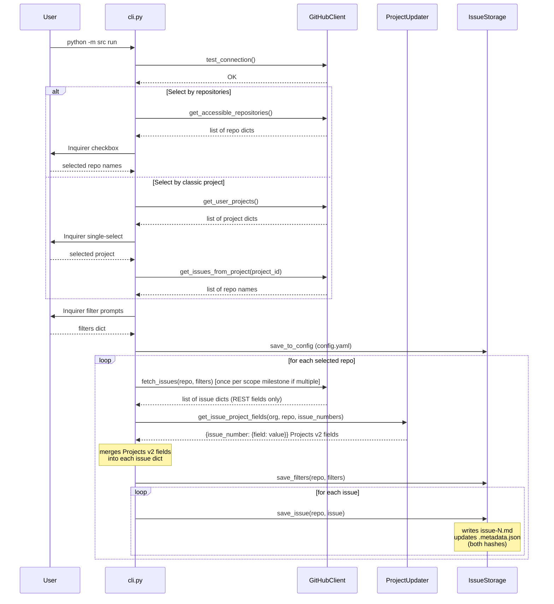
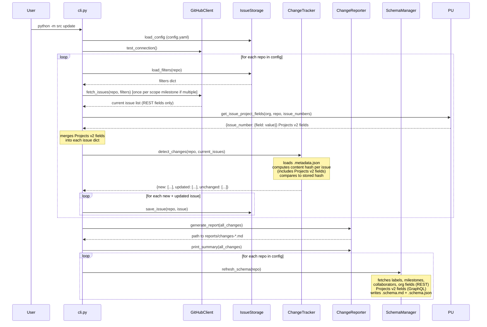
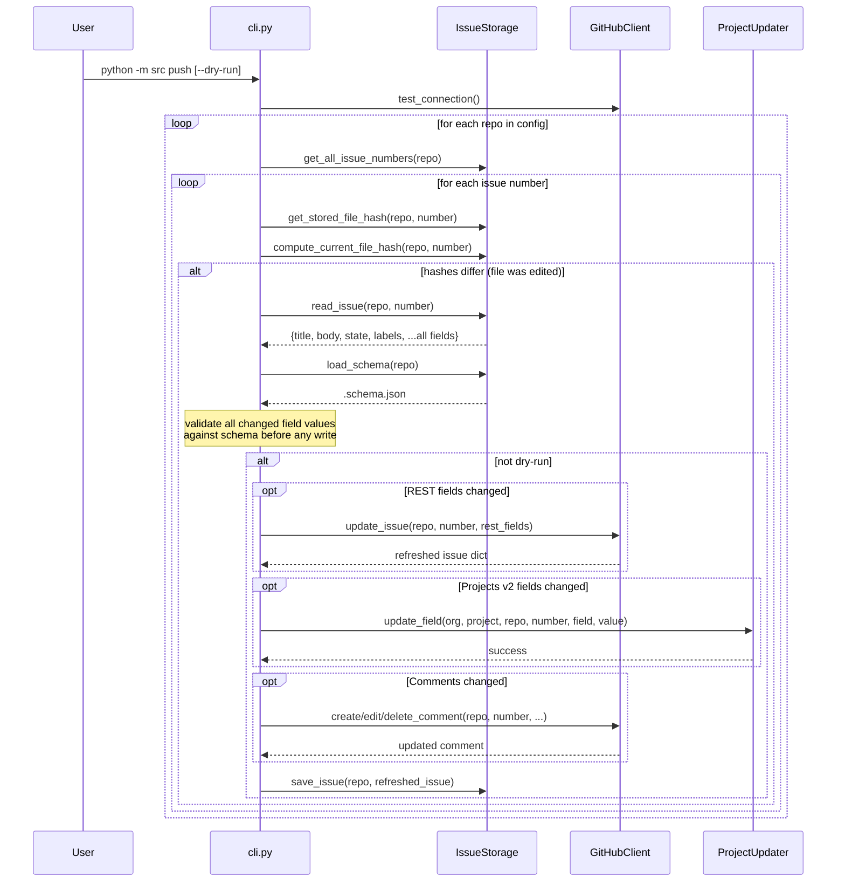
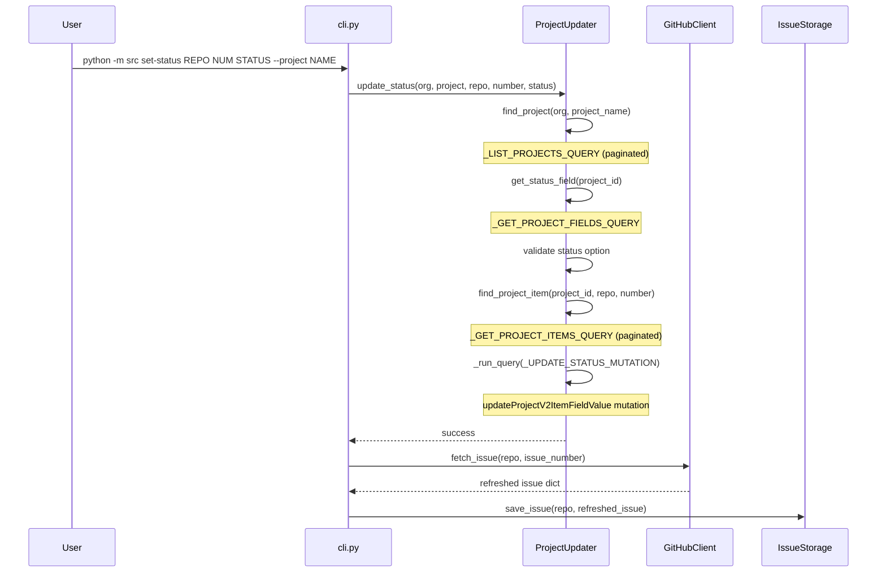
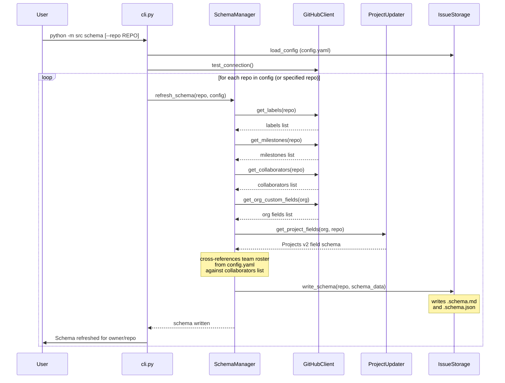
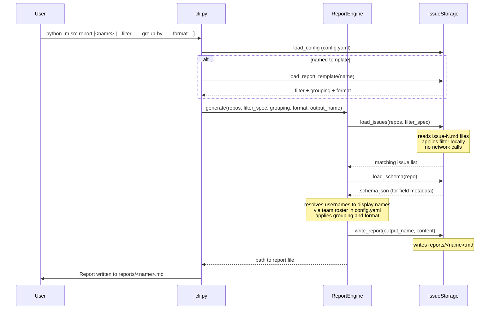
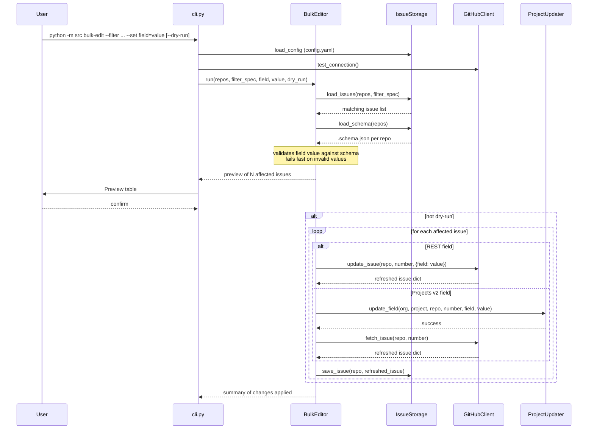

# Architecture — GitHub Issue Manager

**Version:** 2.1.0  
**Last updated:** March 2026

---

## System Overview

GitHub Issue Manager is a single-process Python CLI application. There is no server, no daemon, and no background process. Every operation is initiated by the user running a command and terminates when that command completes.

The codebase is organized as a Python package under `src/`. A standalone script, `query_project_status.py`, exists at the repo root for historical reasons; its functionality is superseded by the `schema` and `discover` commands and it is not invoked by any CLI command.

---

## Module Map



---

## Module Responsibilities

### `src/cli.py`

The entry point for all user-facing commands. Built on [Click](https://click.palletsprojects.com/) for command parsing and [Inquirer](https://python-inquirer.readthedocs.io/) for interactive terminal prompts. Defines ten commands:

| Command | Description |
|---|---|
| `run` | Interactive wizard to configure repositories and extract issues |
| `update` | Incremental sync of tracked repositories; refreshes schema on each run |
| `status` | Show current config and sync state |
| `discover` | Discover repositories and Projects v2 |
| `push` | Validate and write locally-edited fields back to GitHub (REST and GraphQL) |
| `set-status` | Update a Projects v2 field on a single issue |
| `schema` | Fetch and write `.schema.md` + `.schema.json` for tracked repositories |
| `team` | List configured team members and their collaborator status per repo |
| `report` | Generate an ad-hoc markdown report from locally stored issue data |
| `bulk-edit` | Apply a single field change to a filtered set of issues |

Does not contain business logic; delegates to the other modules.

### `src/github_client.py`

Wraps the GitHub REST API using the [PyGithub](https://pygithub.readthedocs.io/) library. Handles authentication via `GITHUB_TOKEN`, and exposes:

- Repository listing and classic project listing
- Issue fetching with filter translation and client-side `until` date filtering
- Milestone title-to-object resolution
- Issue field writes: title, body, state, state reason (`completed`/`not_planned`), labels, milestone, assignees, lock, lock reason
- Comments: read all, create, edit, delete
- Timeline events: read (returns ordered list of event dicts)
- Reactions: read on issues and comments
- Org-level custom issue fields: read and write

Returns plain Python dicts; callers never interact with PyGithub objects directly.

### `src/storage.py`

Manages the local file system. Writes each issue as a markdown file with YAML frontmatter containing all readable fields (REST fields, Projects v2 fields, reactions, linked PRs, sub-issues). Maintains a `.metadata.json` file per repository tracking two independent hashes per issue. Writes `.schema.md` and `.schema.json` schema documents per repository directory. Handles reading issue files back into dicts for the `push` and `bulk-edit` commands.

### `src/tracker.py`

Detects which issues are new, updated, or unchanged by comparing the content hash of each freshly fetched issue against the stored content hash in `.metadata.json`. Has no network dependency; takes a list of issue dicts and a storage instance as inputs.

### `src/reporter.py`

Generates timestamped markdown change reports after each `update` run. Writes files to `reports/changes-YYYY-MM-DD-HH-MM-SS.md` and prints a summary to the console. Handles only sync change reports — not ad-hoc user-defined reports. Has no `IssueStorage` or network dependency; it writes report files directly to the `reports/` directory passed to its constructor.

### `src/project_updater.py`

Executes GitHub Projects v2 operations via the GraphQL API using raw `requests` calls (PyGithub has no Projects v2 support). Generalized to handle any Projects v2 field type — not only Status. Exposes:

- Project discovery and pagination
- Field schema introspection: all field names, types, and valid options (single-select, iteration, number, date, text)
- Finding a project item by issue
- `updateProjectV2ItemFieldValue` mutation for: single-select (status, priority, issue type), iteration, number (estimate), date (start/end), text, and parent issue

### `src/schema_manager.py`

Fetches schema data from GitHub and writes two files per tracked repository:

- `.schema.md` — human-readable, organized by field group, for reading in an editor or by an AI agent
- `.schema.json` — machine-readable, loaded by `push` and `bulk-edit` at runtime for pre-write validation

Fetches:
- Labels (name, color, description) via REST
- Milestones (title, state, due date) via REST
- Repository collaborators via REST
- Org-level custom issue fields via REST
- All Projects v2 board fields, types, and valid options via GraphQL

Cross-references the team roster from `config.yaml` so display names appear alongside GitHub usernames in the collaborator section. Called explicitly by the `schema` command and automatically at the end of each `update` run.

### `src/report_engine.py`

Generates ad-hoc markdown reports from locally stored issue files. Has no network dependency; reads only the issue markdown files and `.schema.json` on disk.

- Accepts a filter specification (same syntax as extraction filters) to select which issues to include
- Applies `scope.milestones` from `config.yaml` as a default milestone filter, consistent with other commands
- Supports grouping by any field (assignee, status, label, milestone, etc.)
- Supports four output formats: `table`, `list`, `full`, `grouped`
- Resolves GitHub usernames to display names via the team roster in `config.yaml`
- Loads named report templates from the `reports` section of `config.yaml`
- Writes output to `reports/<name>.md`; name defaults to a slug derived from the filter arguments

### `src/bulk_editor.py`

Applies a single field change to a filtered set of issues in one operation.

- Accepts the same filter specification as `report` to define the target set
- Reads matching issues from local storage to build the preview list
- Shows a preview of affected issues before writing
- Routes each field write to the correct API: `GitHubClient` for REST fields, `ProjectUpdater` for Projects v2 fields
- Validates field values against `.schema.json` before writing
- Refreshes local issue files after writing
- Honors `--dry-run`

### `query_project_status.py`

A legacy standalone script that is not part of the `src` package. Hardcoded to the `DBDHub` organization and the `MyConnect` project. Queries project items filtered by status and milestone via GraphQL and includes a REST fallback that reuses `GitHubClient`. Its functionality is superseded by the `schema`, `discover`, and `report` commands and it is not invoked by any CLI command.

---

## Storage Layout

```
$base_dir/                            ← ./issues/ or $PROJECT_CONTEXT_DIR/github-issues/
└── <owner>-<repo>/                   ← slash in repo name replaced with hyphen
    ├── issue-1.md
    ├── issue-2.md
    ├── issue-N.md
    ├── .metadata.json
    ├── .schema.md                    ← human-readable field schema
    └── .schema.json                  ← machine-readable schema for push validation

reports/
├── changes-YYYY-MM-DD-HH-MM-SS.md   ← auto-generated after each update run
└── <name>.md                         ← user-requested ad-hoc report
```

### Issue Markdown File Format

```markdown
---
number: 42
title: Bug in login form
state: open
state_reason: null
locked: false
lock_reason: null
labels:
- bug
- high-priority
author: johndoe
created_at: '2025-01-01T10:00:00'
updated_at: '2025-01-02T14:30:00'
assignees:
- developer1
milestone: v2.0
url: https://github.com/owner/repo/issues/42
project_status: In Progress
priority: High
iteration: Sprint 4
issue_type: Bug
estimate: 3
parent_issue: null
sub_issues_progress: 0.5
linked_pull_requests:
- number: 99
  url: https://github.com/owner/repo/pull/99
  state: open
reactions:
  '+1': 4
  '-1': 0
  laugh: 0
  hooray: 1
  confused: 0
  heart: 2
  rocket: 0
  eyes: 1
---

# Bug in login form

The login button doesn't work on mobile devices...

## Comments

### Comment #1891234 by developer1 on 2025-01-02T14:30:00

Thanks for reporting. We'll fix this in the next release.

## Timeline

- 2025-01-01T10:00:00 — labeled: bug (by johndoe)
- 2025-01-02T09:00:00 — assigned: developer1 (by johndoe)
- 2025-01-02T12:00:00 — milestoned: v2.0 (by developer1)
```

### `.metadata.json` Structure

```json
{
  "filters": {
    "state": "open",
    "labels": ["bug"]
  },
  "issues": {
    "42": {
      "hash": "<sha256 of normalized issue data>",
      "file_hash": "<sha256 of rendered markdown file content>",
      "updated_at": "2025-01-02T14:30:00",
      "state": "open"
    }
  }
}
```

---

## Two-Hash Design

Each issue entry in `.metadata.json` records two independent SHA-256 hashes:

| Hash | Field | Input | Purpose |
|---|---|---|---|
| Content hash | `hash` | Normalized JSON of issue fields: number, title, body, state, labels, assignees, updated\_at, comments | Detect upstream changes from GitHub (used by `update` via `ChangeTracker`) |
| File hash | `file_hash` | Full UTF-8 content of the rendered markdown file | Detect local hand-edits since the file was last written (used by `push`) |

These two concerns are deliberately separated. `ChangeTracker` only reads the `hash` field. The `push` command reads `file_hash` (to determine whether a file is dirty) and `snapshot` (to identify which specific fields changed since the file was last written). This means a user can edit a local file, run `push`, and the tool will correctly identify the local change without interfering with the upstream change-detection logic.

---

## Configuration

### `config.yaml`

Stores tracked repositories, the active project scope, the team roster, and saved report templates. All sections except `repositories` are optional.

```yaml
# Repositories the tool tracks
repositories:
  - owner/repo1
  - owner/repo2

# Project scope — constrains which milestones all operations default to.
# Commands can override with --milestone <title> or escape with --milestone all.
scope:
  milestones:
    - "v2.0"
    - "Q1 2026"

# Team roster — maps GitHub usernames to human display names.
# Display names are used in reports and accepted as assignee input.
team:
  - username: jsmith123
    name: "John Smith"
    role: "Backend Engineer"
  - username: mli
    name: "Michelle Li"
    role: "Product Manager"

# Saved report templates — invoked by name with: python -m src report <name>
reports:
  sprint-status:
    filter: {iteration: current}
    group-by: status
    format: grouped
  open-bugs:
    filter: {labels: [bug], state: open}
    sort-by: created_at
    format: table
```

### `.env`

| Variable | Required | Description |
|---|---|---|
| `GITHUB_TOKEN` | Yes | GitHub personal access token |
| `PROJECT_CONTEXT_DIR` | No | If set, issues are stored under `$PROJECT_CONTEXT_DIR/github-issues/` instead of `./issues/` |

Token scope requirements:
- `repo` — read/write access to private repositories and all issue fields
- `project` — required for reading and writing GitHub Projects v2 fields
- `read:org` — required for listing org-level Projects v2 and custom fields

---

## REST vs. GraphQL

The tool uses two distinct GitHub API surfaces:

| Operation | API | Library/Method |
|---|---|---|
| List repositories | REST | PyGithub `user.get_repos()` |
| List classic projects | REST | PyGithub `org.get_projects()` |
| Fetch issues | REST | PyGithub `repo.get_issues()` |
| Update issue title/body | REST | PyGithub `issue.edit()` |
| Update issue state / state reason | REST | PyGithub `issue.edit()` |
| Update issue labels | REST | PyGithub `issue.edit()` |
| Update issue milestone | REST | PyGithub `issue.edit()` |
| Update issue assignees | REST | PyGithub `issue.edit()` |
| Lock / unlock issue | REST | PyGithub `issue.edit()` |
| Read all comments | REST | PyGithub `issue.get_comments()` |
| Create comment | REST | PyGithub `issue.create_comment()` |
| Edit comment | REST | PyGithub `comment.edit()` |
| Delete comment | REST | PyGithub `comment.delete()` |
| Read timeline events | REST | PyGithub `issue.get_timeline()` |
| Read issue reactions | REST | PyGithub `issue.get_reactions()` |
| Read comment reactions | REST | PyGithub `comment.get_reactions()` |
| List repository collaborators | REST | PyGithub `repo.get_collaborators()` |
| List repository labels | REST | PyGithub `repo.get_labels()` |
| List repository milestones | REST | PyGithub `repo.get_milestones()` |
| Read org-level custom fields | REST | `requests.get` to `/orgs/{org}/properties/schema` |
| Write org-level custom fields | REST | `requests.patch` to `/repos/{owner}/{repo}/properties/values` |
| List Projects v2 | GraphQL | `requests.post` to `/graphql` |
| Get project field schema | GraphQL | `requests.post` to `/graphql` |
| Get project Status field | GraphQL | `requests.post` to `/graphql` |
| Get project iterations | GraphQL | `requests.post` to `/graphql` |
| Find project item by issue | GraphQL | `requests.post` to `/graphql` |
| Update project item — single-select (status, priority, issue type) | GraphQL | `updateProjectV2ItemFieldValue` mutation |
| Update project item — iteration / sprint | GraphQL | `updateProjectV2ItemFieldValue` mutation |
| Update project item — number (estimate / story points) | GraphQL | `updateProjectV2ItemFieldValue` mutation |
| Update project item — date (start date, end date) | GraphQL | `updateProjectV2ItemFieldValue` mutation |
| Update project item — text (custom fields) | GraphQL | `updateProjectV2ItemFieldValue` mutation |
| Update project item — parent issue | GraphQL | `updateProjectV2ItemFieldValue` mutation |

The REST/PyGithub path handles all standard issue fields and comments. Projects v2 has no REST API support, so `project_updater.py` makes direct HTTP requests to the GraphQL endpoint using a `requests.Session` with Bearer token authentication.

---

## Data Flow: `run` Command



---

## Data Flow: `update` Command



---

## Data Flow: `push` Command



---

## Data Flow: `set-status` Command



---

## Data Flow: `schema` Command



---

## Data Flow: `report` Command



---

## Data Flow: `bulk-edit` Command


